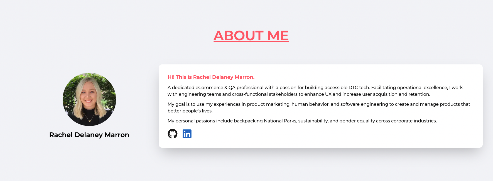
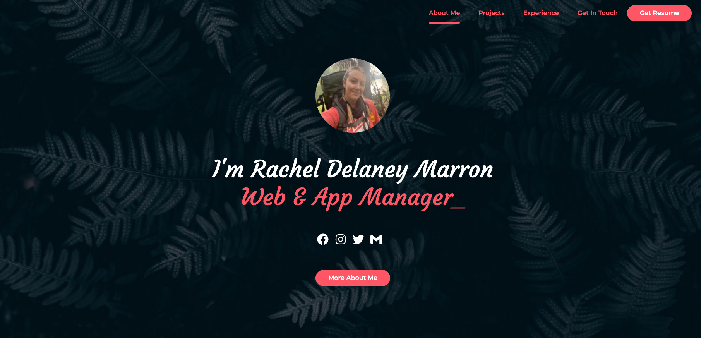
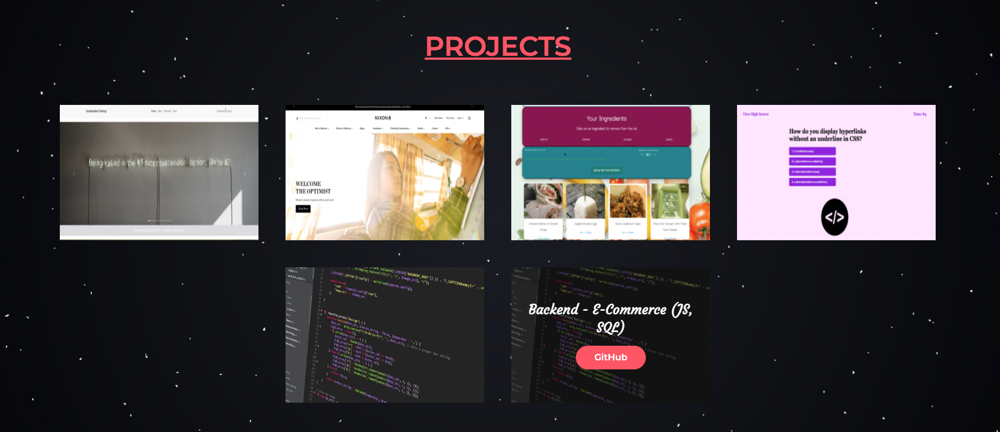
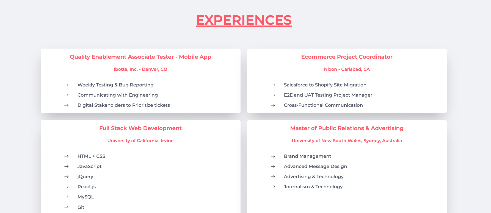

# rdmdevportfolio - REACT 
Development Portfolio for Rachel Marron- Web/App Manager & QA Engineer

## Link to deployed application 
<a href="https://racheldmarron.github.io/rdmdevportfolio-react/">https://racheldmarron.github.io/rdmdevportfolio-react/</a>

## Overview 
A professional portfolio using REACT and Tailwind CSS. This website showcases the development work I have done through the UCI Coding Bootcamp. You are able to view my projects, learn about me, and download my resume. 

## User Story
<ul><li>
AS AN employer looking for candidates with experience building single-page applications</li>
<li>I WANT to view a potential employee's deployed React portfolio of work samples</li>
<li>SO THAT I can assess whether they're a good candidate for an open position</li></ul>

## Acceptance Criteria
<ul><li>
GIVEN a single-page application portfolio for a web developer</li>
<li>WHEN I load the portfolio</li>
<li>THEN I am presented with a page containing a header, a section for content, and a footer</li>
<li>WHEN I view the header</li>
<li>THEN I am presented with the developer's name and navigation with titles corresponding to different sections of the portfolio</li>
<li>WHEN I view the navigation titles</li>
<li>THEN I am presented with the titles About Me, Portfolio, Contact, and Resume, and the title corresponding to the current section is highlighted</li>
<li>WHEN I click on a navigation title</li>
<li>THEN I am presented with the corresponding section below the navigation without the page reloading and that title is highlighted</li>
<li>WHEN I load the portfolio the first time</li>
<li>THEN the About Me title and section are selected by default</li>
<li>WHEN I am presented with the About Me section</li>
<li>THEN I see a recent photo or avatar of the developer and a short bio about them</li>
<li>WHEN I am presented with the Portfolio section</li>
<li>THEN I see titled images of six of the developer’s applications with links to both the deployed applications and the corresponding GitHub repositories</li>
<li>WHEN I am presented with the Contact section</li>
<li>THEN I see a contact form with fields for a name, an email address, and a message</li>
<li>WHEN I move my cursor out of one of the form fields without entering text</li>
<li>THEN I receive a notification that this field is required</li>
<li>WHEN I enter text into the email address field</li>
<li>THEN I receive a notification if I have entered an invalid email address</li>
<li>WHEN I am presented with the Resume section</li>
<li>THEN I see a link to a downloadable resume and a list of the developer’s proficiencies</li>
<li>WHEN I view the footer</li>
<li>THEN I am presented with text or icon links to the developer’s GitHub and LinkedIn profiles, and their profile on a third platform (Stack Overflow, Twitter)</li></ul>

## Visual References

## Contributors

Thank you to the following people/resources that helped me build this app: 
<ul><li>
Jordan Hessler - Outside Tutor</li>
<li>Mohammed Khalid - Outside Tutor</li>
<li><a href="https://www.udemy.com/course/build-a-portfolio-with-reactjs/?utm_source=adwords&utm_medium=udemyads&utm_campaign=LongTail_la.EN_cc.US&utm_content=deal4584&utm_term=_._ag_81829991707_._ad_532193666393_._kw__._de_c_._dm__._pl__._ti_dsa-1007766171312_._li_9031562_._pd__._&matchtype=&gclid=CjwKCAjwve2TBhByEiwAaktM1LRCh4mU8R3eoCxenXbcqpnbzmyiVKc8XbSFxjRr3jbJ1y9bapmO7hoCOxoQAvD_BwE">Udemy.com - Build a portfolio with REACT.JS</a></li>
<li><a href="https://www.youtube.com/watch?v=8vQeMZbUt98">Beginner React portfolio with Taildwindcss</a></li>
<li><a href="https://www.youtube.com/watch?v=bmpI252DmiI">REACT portfolio tutorial with animations</a></li>
<li><a href="https://www.youtube.com/watch?v=Vp6GC3jKG20">Build & Deploy a professional portfolio with REACT and TailwindCSS</a></li>
<li><a href="https://www.youtube.com/watch?v=1eXQJYL1s1k">Typewriter effect in ReactJS Tutorial</a></li>
<li><a href="https://www.youtube.com/watch?v=nbHlVrkA0wk">How to add and download PDF In React.js</a></li></ul>

## License

This application is covered under MIT License    

- - -

© 2022 Rachel Delaney Marron, Inc. All Rights Reserved.
